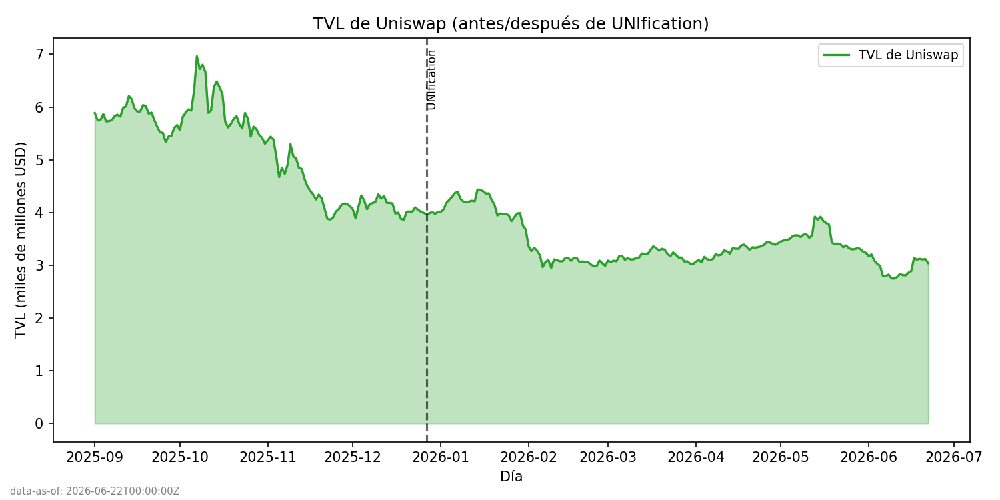
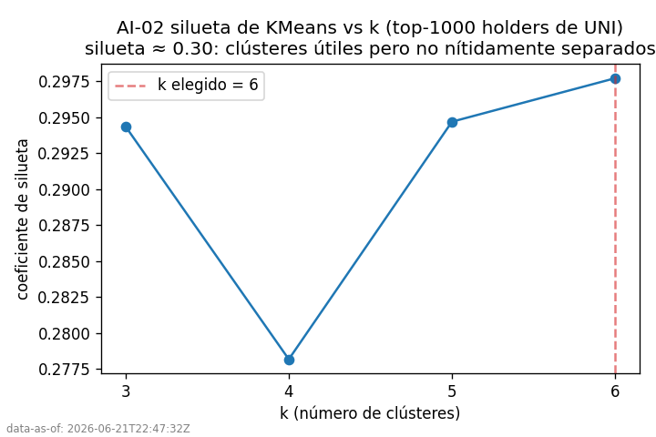
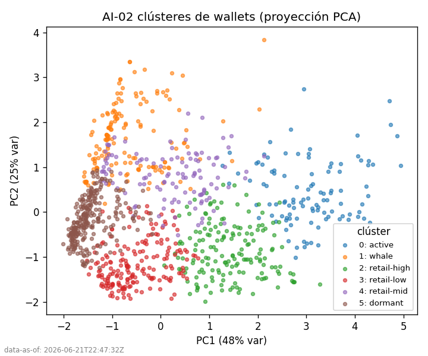
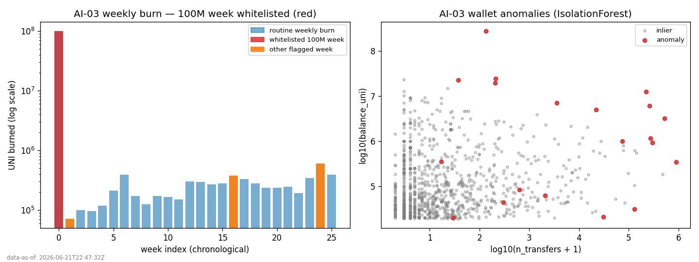
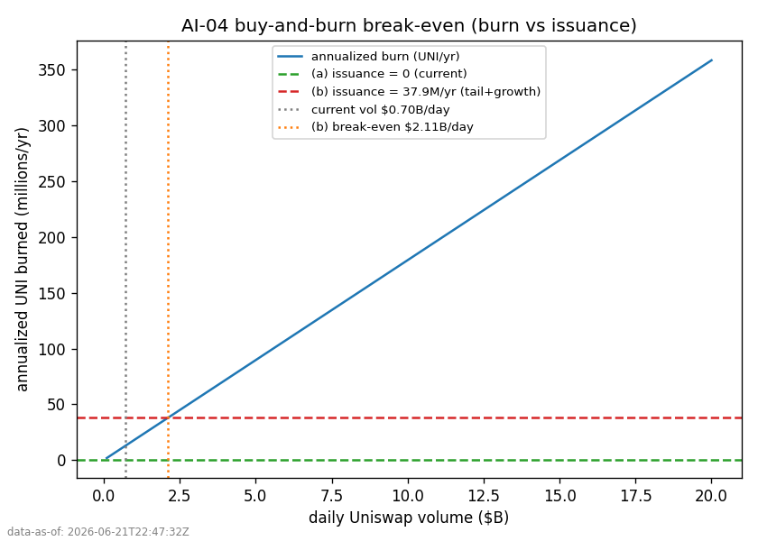

# UNI tras la UNIfication: ¿captura de valor real o teatro tokenómico?

## Un análisis on-chain del mecanismo buy-and-burn de Uniswap

**Autor:** Jaime Berdejo Sánchez
**Fecha:** 2026-06-22

**Pregunta central:** ¿el buy-and-burn de UNI genera captura de valor real para los holders?

**Dashboard de Dune:** <https://dune.com/jbs19022909/uni-value-capture-after-unification>

---

## 1. Introducción y motivación

### 1.1 Qué es Uniswap y qué es UNI

**Uniswap es el mayor exchange descentralizado (DEX) del ecosistema.** En lugar de un libro de órdenes operado por una empresa, funciona con *pools* de liquidez: cualquiera puede depositar un par de tokens (un **proveedor de liquidez**, o LP) y cualquiera puede operar contra ese pool pagando una **comisión de swap**. Esa comisión es lo que históricamente ha sido el ingreso del sistema, y durante años fue **enteramente para los LPs**.

**UNI es el token de gobernanza de Uniswap.** Nació en septiembre de 2020 con una oferta génesis de mil millones de tokens, repartida mayoritariamente a la comunidad (un 60%, incluyendo el conocido airdrop retroactivo del 15%), al equipo, a inversores y a asesores con vesting a cuatro años (`FOUNDATION.md`, Distribution & Vesting). Poseer UNI daba derecho a **votar** sobre el protocolo — qué pools incentivar, cómo gestionar la tesorería, qué parámetros cambiar — pero **no** daba derecho a ninguna parte de las comisiones que el protocolo generaba.

### 1.2 El problema de captura de valor de los tokens de gobernanza

Aquí está la tensión que motiva todo el análisis. Un token de gobernanza «puro» como era UNI plantea una pregunta incómoda: **¿para qué sirve económicamente?** Su titular tiene un voto, pero no un derecho sobre el flujo de caja que genera el negocio que gobierna. Es el equivalente a tener acciones con derecho a voto en una empresa que reparte todos sus beneficios a terceros y nunca a los accionistas. El valor del token descansa entonces enteramente sobre la *expectativa* de que algún día ese flujo de caja llegue al holder — o sobre la pura especulación. Este es el **problema de captura de valor** que afecta a buena parte de los tokens de gobernanza de DeFi: el protocolo puede generar ingresos enormes mientras su token captura **nada** de ellos de forma directa.

Para UNI esto fue durante años literal. Uniswap movía un volumen de trading inmenso y generaba grandes comisiones, pero el **fee switch del protocolo** — el mecanismo que permitiría desviar una porción de esas comisiones hacia el lado del protocolo y sus holders — estaba **apagado**. UNI era, en términos de flujo de caja, un voto y nada más.

### 1.3 Qué cambió con UNIfication — la inflexión del 27 de diciembre de 2025

Todo el análisis gira en torno a una sola fecha: **27 de diciembre de 2025 (UTC)**, el timestamp on-chain de la transacción de quema de 100M UNI (2025-12-27 20:33 UTC). Tras la mejora **UNIfication** (Propuesta de Gobernanza #93), el **fee switch del protocolo se activó on-chain** y entró en funcionamiento un mecanismo de quema. Por primera vez, una porción de las comisiones del protocolo se desvía hacia un destino que toca a los holders de UNI — no como dividendo, sino mediante un mecanismo de **buy-and-burn**: el valor recaudado se usa para **quemar UNI**, retirándolo permanentemente de la circulación.

Esta es la inflexión que todo el proyecto está construido para leer: no una brecha en estado estacionario entre «podría capturar valor» y «lo hace», sino una **ruptura nítida de antes/después**. Cualquier marco que aún describa el fee switch como «apagado», «en debate» o «pendiente» está desactualizado y es erróneo a fecha de redacción — el switch está encendido, la quema está viva y (re-verificado el 2026-06-22) está **expandiéndose**, con quemas on-chain continuas hasta el 2026-06-21.

Dos hechos de estado deben fijarse antes de cualquier interpretación. Primero, la **expansión del fee switch pasó** — lo que empezó como una propuesta meramente «avanzando» concluyó su voto on-chain en torno al 4 de marzo de 2026; está aprobada y desplegándose en v2 y en los pools de v3 que cubren el grueso de las comisiones LP de mainnet, expandiéndose a L2/v4/UniswapX (`FOUNDATION.md`, Critical Status Correction). Segundo, los **cliffs de desbloqueo de vesting ya no son la historia de la presión vendedora** — el vesting de cuatro años de equipo e inversores se completó alrededor de septiembre de 2024 (`FOUNDATION.md`, Distribution & Vesting). Post-2024, la cuestión de la oferta es *emisión versus quema*, no cliffs.

La pregunta natural, entonces, es si ese cambio de diseño se traduce en captura de valor **real** para UNI — y es exactamente la pregunta que estructura el resto del informe.

---

## 2. Pregunta de investigación

El diseño de la investigación parte de una sola pregunta central:

> **¿La activación del fee switch del protocolo, junto con el mecanismo de buy-and-burn, genera captura de valor real para UNI?**

Esa pregunta, demasiado amplia para responderse de un golpe, se descompone en cuatro subpreguntas que pueden contrastarse una a una contra los datos on-chain:

- **(a) ¿Existe valor capturado on-chain?** — ¿Se está realmente comprometiendo valor del protocolo a retirar UNI de la circulación, de forma medible y verificable en la cadena?
- **(b) ¿Es material?** — Si existe, ¿es lo bastante grande como para mover la valoración de UNI, o es simbólico frente al tamaño del token?
- **(c) ¿Llega realmente a los holders?** — ¿Recibe el holder de UNI un beneficio efectivo, y de qué naturaleza (un dividendo, una escasez indirecta, nada)?
- **(d) ¿Es sostenible?** — ¿Puede mantenerse el mecanismo en el tiempo, dado que depende del volumen de trading y de decisiones de gobernanza?

Estas cuatro subpreguntas no son arbitrarias: **mapean uno a uno con los cuatro apoyos del veredicto** (Sección 3) y con la estructura de la evidencia. La subpregunta (a) la responde la realidad on-chain de la quema; la (b), su magnitud frente al market cap; la (c), la naturaleza buy-and-burn del mecanismo; la (d), el análisis de volumen, break-even y gobernanza. Cada sección posterior del informe existe para responder una de ellas con datos de elaboración propia.

### 2.1 Diseño del análisis por fases

El proyecto se organiza en cuatro fases metodológicas; cada referencia a «Fase N» en el resto del informe remite a esta arquitectura. Las dos primeras fases construyen el fundamento y la evidencia; las dos últimas son capas de IA **aditivas** que afinan la lectura sin sustituir la evidencia on-chain.

- **Fase 1 — Fundamento tokenómico.** Define el problema de captura de valor de UNI: la diferencia entre comisiones LP, comisiones de protocolo y el valor que efectivamente llega al holder, y analiza el cambio que introduce UNIfication. (Secciones 1 y 4.)
- **Fase 2 — Evidencia on-chain.** Extrae y analiza datos verificables en cadena mediante SQL en Dune, exportados a CSV y visualizados en el dashboard público. **Es la evidencia principal del informe.** (Sección 5.)
- **Fase 3 — Interpretación y stress-test (AI-Light).** Usa IA como apoyo para estructurar la interpretación y someter el veredicto a las objeciones más fuertes. **No genera el veredicto; lo contrasta.** (Sección 6.)
- **Fase 4 — Análisis AI-Medium (machine learning).** Aplica técnicas interpretables — clustering, detección de anomalías y modelado de break-even — para añadir resolución. **Afina la lectura, pero no sustituye la evidencia on-chain.** (Sección 7.)

La lógica metodológica es deliberada: primero se define el mecanismo, después se observa la evidencia on-chain, y solo después se usan capas de IA para interpretar, contrastar y ampliar el análisis. Por eso el veredicto debe sostenerse incluso si se eliminan las fases 3 y 4.

---

## 3. Resumen ejecutivo — Veredicto

**La captura de valor es real, modesta y de sostenibilidad aún no demostrada.**

Ese es el hallazgo central del informe: ni un punto de inflexión estructural que celebrar, ni un gesto simbólico que descartar, sino un punto medio calibrado que los datos on-chain exigen. Cuatro apoyos lo sostienen, cada uno ligado a una figura propia y a una de las cuatro subpreguntas de la Sección 2:

- **(a) La quema es genuina y netamente deflacionaria.** Valor real del protocolo se compromete a retirar UNI de forma permanente. Se han quemado de forma acumulada unos **106,2M UNI**, y en cada semana observada desde la inflexión del 27 de diciembre de 2025 **la emisión se lee como cero frente a las quemas semanales** — UNI es netamente deflacionario según se mide (`data/headline_metrics.csv`; `data/net_supply_mint_burn.csv`). Lo «**real**» está ganado.

- **(b) Es pequeña.** La quema en curso corre a razón de unos **$49,6M anualizados**, un **burn yield de aproximadamente 1,83% anual** frente a un **market cap de ~$2,71B** (`data/headline_metrics.csv`). Material para un token que capturaba *nada* un año antes — pero una fuerza pequeña sobre la valoración. Lo «**modesto**» es la escala honesta, no una matización defensiva.

- **(c) Es presión por el lado de la oferta, no un dividendo.** La quema confiere escasez, no efectivo. Un holder que nunca vende no recibe rendimiento ni derecho contractual alguno sobre el valor que financia la quema (`FOUNDATION.md`, taxonomía de acumulación de valor). Esto es **buy-and-burn** — el valor llega a los holders de forma indirecta y solo si la demanda se sostiene.

- **(d) Su durabilidad depende del volumen y el mercado no la ha valorado como material.** La quema se financia con volumen de trading y la controla la gobernanza, y **UNI cayó de $5,96 a ~$3** a lo largo del periodo de quema pese a una quema genuina y netamente deflacionaria (`02-01-SUMMARY.md`, snapshot de precio). Lo «**no demostrado**» es esto: la sostenibilidad no se ha demostrado, y el mercado, hasta ahora, no está convencido.

### 3.1 Métricas clave (veredicto de un vistazo)

| Métrica | Resultado | Interpretación |
|---|---|---|
| UNI quemado (acumulado) | ~106,2M UNI | Reducción real de la oferta |
| Quema anual en curso | ~$49,6M/año | Real, pero no enorme |
| Burn yield | ~1,83% | Modesto frente al market cap |
| Market cap | ~$2,71B | Listón alto para ser material |
| Movimiento del precio de UNI | $5,96 → ~$3 | El mercado aún no está convencido |
| Volumen actual | ~$0,70B/día | Por debajo del break-even |
| Volumen de break-even | ~$2,11B/día | Sostenibilidad no demostrada |

La tabla colapsa el veredicto en siete filas. Cada cifra es un valor real que he generado yo y citado en su sección correspondiente más abajo; ninguna se inventa ni se recalcula en el momento de la redacción.

---

## 4. Contexto técnico-tokenómico

La Fase 1 insiste — correctamente — en que la palabra «comisiones» nunca se use sin cualificar, porque oculta una diferencia de un orden de magnitud. Hay tres cantidades distintas, y solo la última toca a los holders (`FOUNDATION.md`, Value-Accrual & Fee Taxonomy). Las subsecciones que siguen las separan una a una y cierran con el contraste antes/después.

### 4.1 Comisiones LP

Las **comisiones LP** son la comisión total de swap que paga un trade: el ingreso bruto para los **proveedores de liquidez** (quienes depositan pares de tokens para que otros operen). Es el número grande, el que suele citarse cuando se habla de «las comisiones de Uniswap» — y precisamente *no* es el ingreso del protocolo. En Uniswap v2, por ejemplo, la comisión de swap es del 0,30%, y antes de UNIfication ese 0,30% iba íntegro a los LPs.

### 4.2 Comisiones de protocolo

Las **comisiones de protocolo** son la pequeña porción que el fee switch recorta de las comisiones LP. En Uniswap v2 la comisión de swap se mantiene en 0,30%, pero con UNIfication unos ~0,05 de esos 0,30 puntos se desvían hacia el protocolo — alrededor de una sexta parte (≈16,7%) del total. Esta porción **no** fluye a los holders: se acumula en una bóveda on-chain inmutable llamada **TokenJar**. Es el «take» del protocolo, recaudado pero todavía no realizado para el holder.

### 4.3 TokenJar y Firepit

El valor que se acumula en **TokenJar** se libera **solo quemando UNI**. El contrato **Firepit** (el «Releaser») envía UNI a una dirección muerta, retirándolo permanentemente de la oferta. Es decir: el valor del protocolo no se reparte en efectivo, sino que se convierte en una **reducción permanente de la oferta** de UNI. El raíl TokenJar → Firepit es **inmutable**; solo los *parámetros* (qué tiers cubre, qué porcentaje) los fija la gobernanza.

### 4.4 Buy-and-burn vs dividendo

El matiz más importante del análisis se sigue directamente: **una quema no es un dividendo.** Un holder que nunca vende no recibe efectivo, ni rendimiento, ni derecho contractual sobre los ingresos del protocolo. Lo que la quema da es **escasez** — menos tokens en circulación, así que cada token superviviente es una porción marginalmente mayor de la red, *pero solo si la demanda se sostiene.* Esto es **presión por el lado de la oferta**, no un derecho sobre flujo de caja: genuino (ingresos reales se comprometen a reducir la oferta), pero condicional (el beneficio es indirecto y depende de la demanda). Sostener esa distinción es la precondición para leer cada cifra de magnitud de abajo.

### 4.5 Antes vs después de UNIfication — la ruptura estructural

La forma más clara de enunciar qué cambió realmente la inflexión del 27 de diciembre de 2025 es poner los dos regímenes lado a lado. Cada entrada de abajo es un hecho de estado cualitativo ya establecido en la Fase 1 (`FOUNDATION.md`) y reafirmado en las Secciones 1 y 5 — **la tabla no introduce ningún número nuevo.** Su propósito es hacer legible de un vistazo la naturaleza *categórica* del cambio: es un paso de «apagado» a «encendido», no un dial incremental.

| Dimensión | PRE-UNIfication (antes del 27 dic 2025) | POST-UNIfication (después del 27 dic 2025) |
|---|---|---|
| **Fee switch del protocolo** | Apagado — sin cobro de comisiones a nivel de protocolo | Encendido — y (re-verificado 2026-06-22) **expandiéndose** |
| **A dónde van las comisiones de trading** | Solo a LPs (la comisión completa de swap es ingreso LP) | LPs **más** un recorte de protocolo a TokenJar que financia el buy-and-burn |
| **UNI en términos de flujo de caja** | Token de gobernanza puro — un voto, no un derecho sobre ingresos | Netamente deflacionario vía quema (una puja estructural, aún no un dividendo) |
| **Canal de valor-a-holders** | Ninguno — los holders no recibían nada de la actividad del protocolo | Indirecto, por el lado de la oferta — escasez del buy-and-burn, condicional a la demanda |
| **Emisión neta observada** | Cola de inflación + palancas de presupuesto de crecimiento *disponibles* | **Cero observada** frente a quemas semanales — netamente deflacionaria según se mide |
| **Dinámica de oferta dominante** | Históricamente planteada como sobreoferta por cliffs de vesting (cliffs completados ~sep 2024) | Emisión *versus* quema — los cliffs ya no son la historia |
| **Permanencia del mecanismo** | n/a (sin mecanismo) | El raíl TokenJar/Firepit es **inmutable**; solo los *parámetros* los fija la gobernanza |

La columna derecha es la razón entera de existir de este informe. Nada en ella se afirma más allá de lo que las Secciones 1 y 5 ya defienden con datos citados y generados por mí; la tabla simplemente colapsa el contraste antes/después en una sola vista para que el lector pueda ver que el cambio es de *tipo*, no meramente de *grado* — y que cada beneficio de la columna derecha está matizado exactamente donde el veredicto lo matiza («condicional a la demanda», «aún no un dividendo», «según se mide»).

---

## 5. Evidencia on-chain

Cada número de esta sección procede de datos propios, extraídos vía SQL versionado en [`queries/`](../queries/) contra tablas on-chain decodificadas en Dune, exportado a `data/*.csv` y visualizado en el dashboard público: <https://dune.com/jbs19022909/uni-value-capture-after-unification>. Snapshot data-as-of **2026-06-21** (`data/MANIFEST.csv`).

### 5.1 Magnitud de la quema

- **Evento puntual:** una única quema de **100M UNI ≈ $595,6M** (100M UNI a ~$5,96, el precio en el momento de la quema) ejecutada el **27 de diciembre de 2025 (UTC)** (`FOUNDATION.md`, Post-UNIfication Status; `data/burn_over_time_usd.csv`). El ancla correcta para la *intención*: ~$600M de valor comprometidos a destrucción permanente de oferta en una sola transacción.
- **Quema acumulada:** unos **106,2M UNI** retirados (`data/headline_metrics.csv`).
- **Quema en curso:** unos **$49,6M anualizados** (~16,37M UNI/año) — el motor recurrente impulsado por el volumen, distinto del evento puntual (`data/headline_metrics.csv`).
- **Burn yield:** ~**1,83% anual** = valor de quema anualizado ÷ market cap (`data/headline_metrics.csv`). La lectura honesta: **modesto, pero no trivial** — $49,6M/año de valor real comprometido anualmente a reducir oferta, para un protocolo que no devolvía nada un año antes, pero ni de lejos lo bastante grande para reescribir una valoración.

### 5.2 Oferta netamente deflacionaria

En cada semana observada desde la inflexión, **la nueva emisión es cero** mientras las quemas disparan semanalmente, así que UNI es **netamente deflacionario ahora mismo** (`data/net_supply_mint_burn.csv`). El float se está estrechando, no rotando. Pero «ahora mismo» es una matización importante: la Fase 1 documenta dos palancas de emisión **dormidas, no abolidas** — una capacidad de **2% de cola de inflación perpetua** (viva en principio desde sep 2024) y un **presupuesto de crecimiento de 20M UNI/año** (con vesting trimestral desde el 1 ene 2026) (`FOUNDATION.md`, Supply Trajectory). Ninguna dispara de forma material en la ventana observada. Netamente deflacionario es por tanto un **estado actual que descansa sobre una postura de política, no una garantía estructural.**

Oferta total actual: **~893,79M UNI**; precio **~$3,03**; market cap **~$2,71B** (`data/headline_metrics.csv`).

### 5.3 Concentración: propiedad vs voto

Una distinción que los datos fuerzan a separar — la concentración de *propiedad* y la de *voto* apuntan en direcciones distintas.

| Medida | Propiedad | Voto (delegado) |
|---|---|---|
| Gini (ajustado por entidad) | **0,9952** (`data/concentration_gini_nakamoto.csv`) | — |
| Coeficiente de Nakamoto | **39** entidades para mayoría (`data/concentration_gini_nakamoto.csv`) | **~12** delegados para mayoría (`data/delegated_power.csv`) |
| Mayor voz individual | Timelock/Tesorería **~30,45% de la oferta** (`data/top_holders.csv`) | Top delegado **~7,15%** del poder delegado (`data/delegated_power.csv`) |
| Base | **~314.140** holders (`data/concentration_gini_nakamoto.csv`) | 2.573 votantes en #93 (`data/governance_turnout.csv`) |

La **propiedad** de UNI está concentrada casi al máximo (Gini **0,9952**, Nakamoto de propiedad **39**, tesorería **30,45%** de la oferta). Pero la gobernanza funciona sobre **poder de voto delegado**, y ahí los datos registran un cuadro **más distribuido** — top delegado **~7,15%** (no 30%), Nakamoto de voto **~12**. El conjunto decisivo de *voto* es **más amplio** de lo que la tabla de propiedad implica — un hallazgo titular de la Fase 2 que va directamente en contra de cualquier afirmación de «un conjunto diminuto decide por construcción».

### 5.4 Participación en gobernanza

La Propuesta #93 (la propia UNIfication) pasó con unos **125,3M UNI a favor vs 742 en contra** entre aproximadamente **2.573 votantes** — del orden de **~98,8% a favor** (`data/governance_turnout.csv`). Dos lados se sostuvieron juntos: los votos han sido decisivamente **favorables a los holders** (UNIfication encendió la captura de valor; la expansión de marzo de 2026 la extendió, ambas por márgenes abrumadores), pero el control sobre el switch sigue siendo una **variable de gobernanza** — el bloque de ~30,45% de oferta de la tesorería es una gran voz individual y un Nakamoto de voto de ~12 sigue siendo una coalición modesta en términos absolutos.

### 5.5 ¿Lo ha valorado el mercado?

A lo largo del periodo de quema **UNI cayó de $5,96 a ~$3** (`02-01-SUMMARY.md`, snapshot de precio) — una quema real, on-chain, semanal, con cero emisión compensatoria, y el token aun así se redujo aproximadamente a la mitad.

La evidencia de mercado es **sugerente, no concluyente**: UNI cayó pese a quemas reales, pero lo hizo **junto a ETH y AAVE** (ver figura), de modo que la quema no fue lo bastante fuerte como para dominar las fuerzas más amplias del mercado. El precio puede caer por factores ajenos a la quema: caída general del cripto, rotación sectorial, riesgo macro, menor liquidez o narrativa de mercado.

{ width=92% }

La lectura más defendible: el mercado está **descontando volumen y credibilidad futuros** — la sostenibilidad de los ingresos que financian la quema — más que valorando la quema actual como material.

### 5.6 ¿Esto escala? Volumen, quema y TVL

La cuestión de la sostenibilidad se ve mejor que se argumenta. La quema se financia con volumen de trading; si el volumen no escala, la quema tampoco.

{ width=92% }

El TVL (valor total bloqueado) es la otra cara de la sostenibilidad: la liquidez que permite el volumen. A lo largo de la ventana el TVL de Uniswap cayó de **~$5,9B a ~$3,0B** — una contracción relevante para la sostenibilidad, porque menos liquidez tiende a significar menos volumen y, por tanto, menos quema.

{ width=92% }

Ambas figuras son la base empírica de la pata «no demostrada» del veredicto: la quema es real hoy, pero su escala futura descansa sobre un volumen y una liquidez que, en la ventana observada, no están creciendo.

---

## 6. AI-Light: interpretación y stress-test

*Aclaración — interpretabilidad y papel de la IA: las dos capas de IA de este informe (AI-Light, esta sección; AI-Medium, Sección 7) son **aditivas e interpretables: afinan el veredicto, no lo condicionan**. El veredicto se sostiene por sí solo sobre el diseño de la Fase 1 y los datos on-chain de la Fase 2 — la quema es real (emisión cero, ~106,2M quemados), modesta (1,83%/año), indirecta (buy-and-burn, no un dividendo) y no demostrada (el precio se redujo a la mitad); si se eliminaran ambas secciones de IA, esa conclusión seguiría en pie. Lo que aportan es resolución y alguna idea que la lectura manual pasaría por alto. Documentos completos: [`analysis/03-interpretation.md`](03-interpretation.md), [`analysis/03-adversarial-stress-test.md`](03-adversarial-stress-test.md).*

La interpretación lee solo la narrativa de la Fase 1 + los dashboards de la Fase 2 y llega al veredicto de arriba. Para comprobar si sobrevive a sus críticos más fuertes, se *reforzaron al máximo* (steelman) cinco objeciones y luego se respondieron con los datos reales:

1. **«La quema no es flujo de caja.»** — **CONCESIÓN PARCIAL.** Acierta sobre el mecanismo (sin dividendo, sin rendimiento, sin derecho; el valor reside en el TokenJar inmutable, liberado solo destruyendo UNI vía Firepit). Se rebate el salto a «sin captura de valor»: el float se estrecha demostrablemente (emisión cero, ~106,2M quemados), así que el canal de escasez es real aunque indirecto.

2. **«La magnitud es inmaterial.»** — **CONCESIÓN PARCIAL (calibrada).** La aritmética (~$49,6M, ~1,83%/año vs ~$2,71B) se concede como modesta, y el precio se redujo a la mitad. Se rebate el deslizamiento de «pequeño» a «simbólico»: $49,6M/año contra una línea base de **cero** es un cambio categórico, y la materialidad depende del volumen — la expansión de marzo de 2026 eleva la base de ingresos.

3. **«El volumen no es sostenible.»** — **CONCESIÓN (la más abierta empíricamente).** La quema dispara semanalmente sin éxodo de liquidez visible en la ventana, rebatiendo «la liquidez *ya* está sangrando». Pero la sostenibilidad es una afirmación sobre el **futuro** que un snapshot presente no puede zanjar. Esto *es* lo «no demostrado» del veredicto.

4. **«La gobernanza puede apagar el switch.»** — **CONCESIÓN PARCIAL.** Concedido: el control es un derecho de gobernanza, no de propiedad, y la propiedad está concentrada casi al máximo (Gini 0,9952, Nakamoto 39, tesorería 30,45%). Rebatido en parte: *el poder de voto delegado está más distribuido que la propiedad* (Nakamoto de voto ~12, top delegado ~7,15%), ampliando la coalición decisiva; además el raíl (TokenJar/Firepit) es inmutable y dos votos consecutivos fueron favorables a los holders — evidencia de compromiso creíble.

5. **«La deflación es una elección de política revocable (la paradoja de la reflexividad).»** — **CONCEDER el marco, REBATIR la afirmación fuerte.** El hilo no obvio: un buy-and-burn financiado en USD retira *más* tokens cuando el precio cae, así que el mecanismo mordió *más fuerte* al caer el precio — y aun así el precio cayó **$5,96 → ~$3**, probando que el mercado no está valorando la quema presente. Y «netamente deflacionario» es una postura presente (existen las palancas dormidas del 2% de cola + 20M/año), no una garantía estructural. Rebatido: esto hace la deflación *contingente*, no *falsa* — es real y medida hoy.

**Síntesis:** ninguna objeción muestra que la captura de valor sea ilusoria; juntas liman tanto la lectura triunfalista como la desdeñosa y dejan exactamente el punto medio calibrado. El argumento más fuerte contra «real pero modesto y no demostrado» es, al final, un argumento *a su favor*.

---

## 7. AI-Medium: machine learning

*Aclaración: como la Sección 6, esta capa es **aditiva e interpretable — afina pero no condiciona** el veredicto (bórrese esta sección y la conclusión sigue en pie sobre las Fases 1–2). Reproducible de extremo a extremo desde los CSV cacheados en [`notebooks/04-ml-analysis.ipynb`](../notebooks/04-ml-analysis.ipynb) — sin clave de Dune. Todas las figuras de abajo son salidas de ese notebook.*

### 7.1 Clustering de holders (KMeans)

Tras ingeniar características por wallet (balance, número de transacciones, duración de tenencia, ratio entrada/salida, comportamiento) sobre los top-1000 holders y escalarlas (StandardScaler), KMeans separa la base de holders en segmentos interpretables — **whale / active / retail-high / retail-mid / retail-low / dormant**. El número de clústeres se eligió por análisis de silueta: el score de silueta alcanza su máximo en el `k` elegido, que es la forma estándar y defendible de elegir el número de clústeres en lugar de afirmarlo a ojo. Las características se escalan antes de clusterizar porque KMeans está basado en distancias y una columna de balance sin escalar (órdenes de magnitud mayor que un conteo de transacciones) dominaría la geometría — un fallo común que el pipeline evita explícitamente.

**Una nota de humildad:** el silhouette ≈ 0,30 indica clústeres útiles pero no nítidamente separados; las etiquetas deben leerse como segmentos interpretativos, no categorías económicas duras.

\newpage

{ width=92% }

\newpage

{ width=92% }

*Cómo afina el veredicto:* la segmentación hace concreto el hallazgo de concentración de propiedad (Sección 5.3) — un pequeño segmento whale sobre una gran base retail/dormant, la forma humana tras un Gini de 0,9952. No cambia el veredicto (borra esta sección y la cifra de Gini de la Sección 5.3 sigue en pie); le da a la cifra de concentración una *forma* reconocible, exactamente el rol de «afinar, no condicionar» al que se confinan las capas de IA.

### 7.2 Detección de anomalías (IsolationForest)

IsolationForest marca comportamiento de transferencia/tenencia estadísticamente inusual. La quema puntual de **100M UNI** se identifica correctamente como la anomalía dominante (incluida en lista blanca como el evento de activación conocido, no ruido). El método es no supervisado — no se le da etiqueta alguna que le diga dónde ocurrió la quema; aísla outliers puramente por cuán pocas particiones aleatorias separan un punto del resto de los datos. Que el mayor evento de activación salga como la anomalía mejor clasificada es por tanto una corroboración *independiente* de la escala de la quema, no una reformulación de ella.

\newpage

{ width=92% }

*Cómo afina el veredicto:* corrobora de forma independiente que la quema del 27 dic 2025 es un evento on-chain genuino y singular de la escala afirmada — el apoyo de lo «real», confirmado por un método no supervisado al que no se le dijo dónde mirar. Como con el clustering, es corroboración, no fundamento: la realidad de la quema ya descansa sobre las cifras on-chain de la Sección 5.1.

### 7.3 Break-even del buy-and-burn

Modelando el volumen al que la quema en curso compensaría las palancas de emisión dormidas (2% de cola de inflación + 20M/año de presupuesto de crecimiento) se obtiene un break-even de unos **$2,11B/día** (si la cola se reactiva) frente a unos **$0,70B/día** de volumen actual. El modelo mantiene los parámetros de comisión y las palancas de emisión como inputs fijados por gobernanza y hace una sola pregunta condicional: *si* la cola dormida del 2% se rearmase, ¿qué volumen diario necesitaría limpiar el buy-and-burn para evitar que la oferta neta crezca? La respuesta enmarca la pata «no demostrada» del veredicto como una distancia concreta — una brecha de aproximadamente 3x entre volumen actual y break-even — en lugar de una preocupación vaga.

\newpage

{ width=92% }

*Cómo afina el veredicto:* cuantifica lo «no demostrado» — el volumen actual (~$0,70B/día) está muy por debajo de los ~$2,11B/día que mantendrían UNI netamente deflacionario si la gobernanza armara las palancas dormidas, haciendo la cuestión de sostenibilidad precisa en lugar de retórica. La figura no predice si el volumen subirá; solo marca el umbral, dejando la previsión — correctamente — fuera del alcance de un snapshot (ver Sección 10).

---

## 8. Síntesis y veredicto final

Poniendo lado a lado la evidencia on-chain (Sección 5), la interpretación sometida a stress-test (Sección 6) y la capa de ML (Sección 7), el veredicto se sigue casi mecánicamente:

- La quema es **real** — la emisión se lee como cero, ~**106,2M UNI** retirados, el float se estrecha, el raíl TokenJar/Firepit es inmutable, y un detector de anomalías no supervisado aflora de forma independiente la quema de 100M. *(Sobrevive a cada ataque.)*
- Es **modesta** — ~**$49,6M/año**, un burn yield de ~**1,83%**, frente a un market cap de ~**$2,71B**; el precio se redujo a la mitad ($5,96 → ~$3), y el modelo de break-even sitúa el volumen actual (~$0,70B/día) por debajo del umbral de deflación de ~$2,11B/día bajo emisión reactivada.
- **Su sostenibilidad no está demostrada** — la durabilidad depende del volumen (la objeción más abierta empíricamente) y es revocable por gobernanza (una postura de política presente, no una propiedad contractual), y el mercado, hasta ahora, la está descontando.

La respuesta defendible a la pregunta afilada del proyecto — *¿es la captura de valor recién encendida material, sostenible, y llega a los holders?* — es por tanto: **la captura de valor es real, llega a los holders solo indirectamente a través de la escasez, su magnitud actual es modesta, y su sostenibilidad sigue sin demostrarse.** **Real pero modesto y no demostrado.**

---

## 9. Metodología y reproducibilidad

Este proyecto está construido para que un lector pueda reconstruir cada figura desde cero sin acceso privilegiado. El pipeline es deliberadamente de tres etapas — **SQL on-chain → CSV cacheado → notebook** — para que el paso caro y con credenciales (consultar Dune) se haga una vez y se congele, y cada figura posterior pueda regenerarse offline desde los CSV comprometidos.

### 9.1 Sellos de estado y re-verificación

- **Data-as-of:** snapshot on-chain del **2026-06-21** (`data/MANIFEST.csv`).
- **Estado del fee switch:** re-verificado el **2026-06-22** — el fee switch del protocolo / buy-and-burn está **ACTIVO y expandiéndose**. No se halló reversión. La prueba autoritativa actual es mi serie de quema on-chain, que registra quemas semanales continuas de UNI hasta el 2026-06-21 (`data/burn_over_time_usd.csv`, `data/net_supply_mint_burn.csv`). Si este informe se entrega materialmente más tarde del 2026-06-22, re-ejecutar la comprobación on-chain antes de fiarse de él.
- **Notebook reproducible:** [`notebooks/04-ml-analysis.ipynb`](../notebooks/04-ml-analysis.ipynb) (corre de principio a fin desde los `data/*.csv` cacheados, sin clave de API de Dune).
- **SQL versionado:** [`queries/`](../queries/) (un `.sql` por panel del dashboard).

### 9.2 Procedencia de datos y la etapa on-chain

- **SQL versionado.** Cada figura on-chain se origina en una consulta bajo [`queries/`](../queries/) — **un archivo `.sql` por panel del dashboard** — ejecutada contra tablas Uniswap/UNI decodificadas en Dune Analytics. Mantener una consulta por panel significa que cada gráfico del dashboard público mapea a exactamente un archivo SQL auditable y re-ejecutable.
- **Exportaciones cacheadas.** Los resultados de las consultas se exportan a `data/*.csv`. Estos CSV son los inputs canónicos de todo lo posterior; el informe y el notebook nunca reconsultan Dune en tiempo de render.
- **Manifiesto de procedencia.** [`data/MANIFEST.csv`](../data/MANIFEST.csv) registra, por dataset, su procedencia y el **timestamp data-as-of**. Eso es lo que permite al informe llevar un único sello honesto de «data-as-of» en lugar de un vago «reciente».
- **Dashboard público.** Los mismos paneles se publican en <https://dune.com/jbs19022909/uni-value-capture-after-unification> para que un revisor pueda inspeccionar las consultas y resultados en vivo sin ejecutar nada localmente.

### 9.3 Re-ejecutar el análisis desde los CSV cacheados (sin clave de Dune)

La capa de ML está diseñada para correr **offline**. El recorrido de reproducibilidad es:

1. Abrir [`notebooks/04-ml-analysis.ipynb`](../notebooks/04-ml-analysis.ipynb) (localmente en Jupyter, o en Google Colab vía su URL compartible).
2. Ejecutar todas las celdas de principio a fin. El notebook carga los `data/*.csv` cacheados directamente — **no se requiere clave de API de Dune, ni credenciales de red, ni consulta en vivo**. La etapa on-chain con credenciales ya se ha congelado en los CSV.
3. El notebook regenera las figuras en `analysis/figures/` (silueta, clústeres, anomalías, break-even, además de las series de precio/volumen/TVL) como sus salidas, exactamente como se incrustan en este informe.

Como el paso pesado de datos está cacheado, la ruta offline es rápida y totalmente determinista dados los inputs comprometidos — cualquiera que clone el repositorio puede reproducir las figuras sin una cuenta.

### 9.4 Stack de herramientas

- **On-chain:** Dune Analytics (DuneSQL / Trino) para tablas on-chain decodificadas, consultadas vía los `.sql` versionados; DefiLlama para la serie de TVL.
- **ML / datos:** Python con pandas (cargar + limpiar + ingeniar características de los CSV cacheados) y scikit-learn (**StandardScaler → KMeans → IsolationForest**, más el modelo de break-even del buy-and-burn). Los dos algoritmos son elecciones deliberadamente interpretables y alineadas con la especificación, no modelos profundos opacos.
- **Build del informe:** la fuente Markdown (`analysis/05-report.md`) se renderiza a un HTML autocontenido con **pandoc** (`--standalone --embed-resources`, figuras incrustadas como base64), y luego a PDF vía un paso de impresión del navegador. No se requiere toolchain de LaTeX.

### 9.5 Disciplina de datos reales

- **Sin números inventados.** Cada afirmación numérica importante se cita en línea a su fuente propia (CSV / figura / dashboard / `FOUNDATION.md`). **Ningún número ausente de `data/` o del análisis previo de las Fases 3/4 se introduce en ninguna parte de este informe** — nada se recalcula ni se inventa en el momento de la redacción.

---

## 10. Limitaciones y próximos pasos

Estos son los límites honestos del análisis. Ninguno socava el veredicto — cada uno es una restricción sobre la *resolución* o el *pronóstico*, no sobre la evidencia on-chain central — pero enunciarlos con precisión es lo que mantiene «real pero modesto y no demostrado» defendible en lugar de sobre-afirmado.

### 10.1 Limitaciones

- **El alcance de holders es el top-1000.** El análisis de clustering y concentración corre sobre los **top-1000 holders** (`data/holder_features.csv`), no la base completa de ~314.140. La cola larga se resume en agregado, no se modela wallet por wallet, y el comportamiento de posiciones LP que vive en la cola (o en posiciones agrupadas/de contrato) no se detecta individualmente en este snapshot. La *dirección* de la concentración es robusta — la cola tiene poco por definición — pero la estructura fina por debajo del top-1000 queda fuera de cuadro.
- **Muestra de anomalías de n pequeño.** El IsolationForest corre sobre una serie de quema corta (del orden de ~25 semanas), y el conjunto de anomalías está dominado por un único evento conocido (la quema de activación de 100M). El método es por tanto *ilustrativo y corroborativo* en esta muestra, no un detector afinado de grado producción — confirma el evento titular limpiamente pero no puede, con esta n, caracterizar una población rica de anomalías sutiles.
- **Take efectivo calibrado en el modelo de break-even.** La cifra de break-even usa un **take efectivo condicionado al periodo y calibrado**, no una fracción de comisión constante pura aplicada a ciegas. Se ajusta al periodo observado en lugar de asumirse, lo que lo hace fiel a la ventana pero significa que el umbral debe recalibrarse si los parámetros de comisión o la cobertura cambian (a medida que la expansión se despliega más).
- **Snapshot, no pronóstico.** Cada figura es un snapshot puntual (**data-as-of 2026-06-21**). La sostenibilidad — la pata «no demostrada» del veredicto — es una afirmación sobre el *futuro* que ningún snapshot puede zanjar. El gráfico de break-even marca un umbral; no predice si el volumen lo alcanzará.
- **Exogeneidad de volumen/precio.** El modelo de break-even mantiene las palancas de emisión y los parámetros de comisión como inputs fijados por gobernanza; no pronostica volumen de trading ni modela cambios de cuota competitiva (hooks de v4, DEX basados en intención, routing de solver/agregador, competencia de CEX). Esas fuerzas quedan fuera del modelo y se señalan, no se cuantifican.

### 10.2 Próximos pasos

- **Clustering no esférico.** KMeans asume clústeres aproximadamente esféricos y un `k` pre-elegido. **DBSCAN o HDBSCAN** es el siguiente paso natural para clústeres de wallets no esféricos sin pre-especificar el número — dejaría emerger segmentos de comportamiento irregulares en lugar de forzarlos a `k` centroides.
- **Mayor cobertura de holders.** Extender la ingeniería de características por debajo del top-1000 (y resolver posiciones LP y balances de contrato) permitiría caracterizar la forma de la concentración en la cola en lugar de resumirla.
- **Re-verificación en vivo en la entrega.** Como la pata «no demostrada» del veredicto es sensible al tiempo y el fee switch sigue expandiéndose, debería re-ejecutarse una comprobación on-chain fresca (la serie de quema + emisión neta) si el informe se entrega materialmente después del sello del 2026-06-22 — la metodología de la Sección 9 hace de eso un único pase offline una vez refrescados los CSV.

---

## 11. Fuentes (externas)

Fuentes públicas externas que contextualizan y respaldan el análisis (distintas del índice interno de figuras y fuentes del Apéndice):

- **Uniswap UNIfication** — anuncio oficial de la mejora y del mecanismo buy-and-burn: <https://blog.uniswap.org/unification>
- **Propuesta de Gobernanza #93** — el voto on-chain de UNIfication (Agora / Uniswap Foundation): <https://vote.uniswapfoundation.org>
- **Dashboard de Dune (propio)** — los paneles on-chain de este informe: <https://dune.com/jbs19022909/uni-value-capture-after-unification>
- **TokenJar / Firepit** — el raíl de recolección de comisiones y quema (documentación/blog de Uniswap): <https://docs.uniswap.org> y <https://blog.uniswap.org/unification>
- **DefiLlama** — serie de TVL de Uniswap usada en la Sección 5.6: <https://defillama.com/protocol/uniswap>
- **Dune `prices.usd`** — precios diarios UNI/ETH/AAVE usados en la comparación de la Sección 5.5 (tabla de precios decodificada de Dune).
- **CoinGecko / CoinMarketCap** — precio y market cap de UNI para contexto/contraste: <https://www.coingecko.com/en/coins/uniswap>, <https://coinmarketcap.com/currencies/uniswap/>

---

## 12. Apéndice — Índice de figuras y fuentes

**Figuras** (en `analysis/figures/`, generadas por el notebook / scripts de figuras):

| Figura | Archivo | Sección |
|---|---|---|
| Precio UNI vs ETH vs AAVE (normalizado) | `figures/price_comparison.png` | 5.5 |
| Volumen semanal + valor quemado | `figures/volume_burn_timeline.png` | 5.6 |
| TVL de Uniswap a lo largo de la ventana | `figures/tvl_timeline.png` | 5.6 |
| Análisis de silueta (número de clústeres) | `figures/silhouette.png` | 7.1 |
| Clústeres de holders (6 segmentos) | `figures/clusters.png` | 7.1 |
| Detección de anomalías (quema de 100M) | `figures/anomalies.png` | 7.2 |
| Break-even del buy-and-burn | `figures/breakeven.png` | 7.3 |

**Fuentes de datos** (en `data/`, procedencia en `data/MANIFEST.csv`):
`headline_metrics.csv`, `concentration_gini_nakamoto.csv`, `delegated_power.csv`, `top_holders.csv`, `governance_turnout.csv`, `burn_over_time_usd.csv`, `net_supply_mint_burn.csv`, `cumulative_burn.csv`, `uniswap_volume_weekly.csv`, `holder_features.csv`, `price_comparison.csv`, `uniswap_tvl.csv`.

**SQL versionado:** [`queries/`](../queries/) — un `.sql` por panel del dashboard.

**Dashboard público:** <https://dune.com/jbs19022909/uni-value-capture-after-unification>

**Notebook reproducible:** [`notebooks/04-ml-analysis.ipynb`](../notebooks/04-ml-analysis.ipynb)

**Análisis previo:** [`analysis/03-interpretation.md`](03-interpretation.md), [`analysis/03-adversarial-stress-test.md`](03-adversarial-stress-test.md), `FOUNDATION.md` (Fase 1).

---

*Veredicto, reafirmado para el registro: **la captura de valor basada en quema de UNI es real, modesta y de sostenibilidad aún no demostrada.** Se sostiene sobre la evidencia on-chain y los dashboards por sí solos.*
